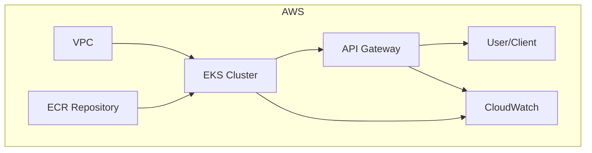

## Managing Sensitive Data with Terraform Secrets

Sensitive data such as subnet IDs, IAM role ARNs, ECR repository ARNs, and EKS cluster ARNs should not be hardcoded in your Terraform code or committed to version control.

### Best Practices
- Use [Terraform input variables](https://developer.hashicorp.com/terraform/language/values/variables) and mark them as `sensitive = true` where appropriate.
- Use [Terraform Cloud/Enterprise workspaces](https://developer.hashicorp.com/terraform/cloud-docs/workspaces) or a remote backend (e.g., S3 with encryption) to securely store state files.
- Use [environment variables](https://developer.hashicorp.com/terraform/cli/config/environment-variables) or a `.tfvars` file (excluded from version control) to provide sensitive values at runtime.
- Use [AWS Secrets Manager](https://docs.aws.amazon.com/secretsmanager/latest/userguide/intro.html) or [SSM Parameter Store](https://docs.aws.amazon.com/systems-manager/latest/userguide/systems-manager-parameter-store.html) for secrets, and reference them in your Terraform code.

### Example: Sensitive Variable Declaration
```hcl
variable "private_subnet_ids" {
  description = "List of private subnet IDs."
  type        = list(string)
  sensitive   = true
}

variable "iam_role_arn" {
  description = "IAM role ARN for EKS nodes."
  type        = string
  sensitive   = true
}

variable "ecr_repo_arn" {
  description = "ECR repository ARN."
  type        = string
  sensitive   = true
}

variable "eks_cluster_arn" {
  description = "EKS cluster ARN."
  type        = string
  sensitive   = true
}
```

### Example: Supplying Sensitive Data
- Use a `terraform.tfvars` file (add to `.gitignore`):
  ```hcl
  private_subnet_ids = ["subnet-xxx", "subnet-yyy"]
  iam_role_arn = "arn:aws:iam::123456789012:role/eks-node-group-role"
  ecr_repo_arn = "arn:aws:ecr:us-east-1:123456789012:repository/bamboocard-api-dev"
  eks_cluster_arn = "arn:aws:eks:us-east-1:123456789012:cluster/bamboocard-eks-dev"
  ```
- Or set as environment variables:
  ```sh
  export TF_VAR_private_subnet_ids='["subnet-xxx","subnet-yyy"]'
  export TF_VAR_iam_role_arn=arn:aws:iam::123456789012:role/eks-node-group-role
  export TF_VAR_ecr_repo_arn=arn:aws:ecr:us-east-1:123456789012:repository/bamboocard-api-dev
  export TF_VAR_eks_cluster_arn=arn:aws:eks:us-east-1:123456789012:cluster/bamboocard-eks-dev
  ```

### Output Handling
Mark outputs as sensitive to avoid accidental exposure:
```hcl
output "ecr_repo_arn" {
  value     = aws_ecr_repository.this.arn
  sensitive = true
}
```

### Further Reading
- [Terraform: Sensitive Data in State](https://developer.hashicorp.com/terraform/language/state/sensitive-data)
- [Terraform: Input Variables](https://developer.hashicorp.com/terraform/language/values/variables#sensitive-variables)
#
# Onboarding, Architecture, and CI/CD Integration

## Onboarding Steps

1. **Clone the repository:**
   ```sh
   git clone <your-repo-url>
   cd bamboo-card-task/infra
   ```
2. **Install prerequisites:**
   - [Terraform](https://www.terraform.io/downloads.html)
   - [AWS CLI](https://docs.aws.amazon.com/cli/latest/userguide/getting-started-install.html)
   - [kubectl](https://kubernetes.io/docs/tasks/tools/)
   - [Docker](https://docs.docker.com/get-docker/)
3. **Configure AWS credentials:**
   ```sh
   aws configure
   ```

4. **Set your deployment environment.**
   - The `environment` variable controls resource naming and isolation for dev, test, and prod.
   - You can set it in your `terraform.tfvars`, as a CLI variable, or in your root `main.tf`:
     ```hcl
     variable "environment" {
       description = "Deployment environment (dev, test, prod)"
       type        = string
       default     = "dev"
     }
     ```

5. **Initialize and apply Terraform:**
   ```sh
   terraform init
   terraform plan
   terraform apply
   ```
6. **Build and push your Docker image to ECR:**
   (See ECR section above for commands.)
7. **Deploy Kubernetes manifests to EKS:**
   (See Kubernetes section above for commands.)

## Architecture Diagram

Below is a high-level architecture for the cloud deployment:



## CI/CD Integration Example (GitHub Actions)

Create a `.github/workflows/deploy.yml` file in your repo:

```yaml
name: CI/CD Pipeline
on:
  push:
    branches: [ main ]

jobs:
  build-and-deploy:
    runs-on: ubuntu-latest
    env:
      AWS_REGION: us-east-1
      ECR_REPO: <aws_account_id>.dkr.ecr.${{ env.AWS_REGION }}.amazonaws.com/bamboocard-api-${{ github.ref_name }}
      CLUSTER_NAME: bamboocard-eks-${{ github.ref_name }}
      ENVIRONMENT: ${{ github.ref_name }}
    steps:
      - uses: actions/checkout@v4
      - name: Configure AWS credentials
        uses: aws-actions/configure-aws-credentials@v4
        with:
          aws-access-key-id: ${{ secrets.AWS_ACCESS_KEY_ID }}
          aws-secret-access-key: ${{ secrets.AWS_SECRET_ACCESS_KEY }}
          aws-region: ${{ env.AWS_REGION }}
      - name: Login to Amazon ECR
        run: aws ecr get-login-password --region $AWS_REGION | docker login --username AWS --password-stdin $ECR_REPO
      - name: Build Docker image
        run: docker build -t $ECR_REPO:latest .
      - name: Push Docker image
        run: docker push $ECR_REPO:latest
      - name: Update kubeconfig
        run: aws eks update-kubeconfig --region $AWS_REGION --name $CLUSTER_NAME
      - name: Deploy to EKS
        run: |
          kubectl set image deployment/bamboocard-api bamboocard-api=$ECR_REPO:latest --namespace=default
          kubectl rollout status deployment/bamboocard-api --namespace=default
```

**Note:**
- Replace `<aws_account_id>` and other placeholders with your actual values.
- Store AWS credentials as GitHub secrets.
- This pipeline builds, pushes, and deploys your app on every push to `main`.
# Infrastructure as Code for BambooCardTask Cloud Migration

This directory contains reusable Terraform modules for deploying the BambooCardTask.API and its supporting infrastructure on AWS. The modules are designed to help you automate and manage your cloud resources for a production-grade, scalable, and observable deployment.

## Module Overview

- **ecr**: Provisions an Amazon Elastic Container Registry (ECR) for storing Docker images.
- **vpc**: Provisions a Virtual Private Cloud (VPC) with public/private subnets and NAT gateway.
- **eks**: Provisions an Amazon Elastic Kubernetes Service (EKS) cluster and node groups.
- **iam**: Provisions IAM roles and policies for EKS nodes and other resources.
- **cloudwatch**: Provisions CloudWatch log groups for centralized logging and monitoring.
- **apigateway**: Provisions an API Gateway HTTP API for exposing your service endpoints.
- **prometheus_grafana**: (Placeholder) Deploys Prometheus and Grafana for observability (use Helm or Kubernetes provider).

## How to Use These Modules

1. **Clone the repository and navigate to the `infra/` directory.**

2. **Create a root Terraform configuration (e.g., `main.tf`) that calls these modules.**


   Example (multi-environment, production-ready):
   ```hcl
   variable "environment" {
     description = "Deployment environment (dev, test, prod)"
     type        = string
     default     = "dev"
   }

   module "vpc" {
     source          = "./modules/vpc"
     name            = "bamboocard-vpc"
     cidr            = "10.0.0.0/16"
     azs             = ["us-east-1a", "us-east-1b"]
     public_subnets  = ["10.0.1.0/24", "10.0.2.0/24"]
     private_subnets = ["10.0.101.0/24", "10.0.102.0/24"]
     environment     = var.environment
   }

   module "ecr" {
     source      = "./modules/ecr"
     name        = "bamboocard-api"
     environment = var.environment
   }

   module "iam" {
     source      = "./modules/iam"
     role_name   = "bamboocard-eks-node-group"
     environment = var.environment
   }

   module "eks" {
     source      = "./modules/eks"
     environment = var.environment
     cluster_name = "bamboocard-eks"
     cluster_version = "1.29"
     subnets     = module.vpc.private_subnets
     vpc_id      = module.vpc.vpc_id
     node_instance_type = "t3.medium"
     node_group_settings = (
       var.environment == "prod" ? {
         prod = {
           desired_capacity = 3
           max_capacity     = 6
           min_capacity     = 2
           instance_type    = "t3.large"
         }
       } : var.environment == "test" ? {
         test = {
           desired_capacity = 2
           max_capacity     = 3
           min_capacity     = 1
           instance_type    = "t3.medium"
         }
       } : {
         dev = {
           desired_capacity = 1
           max_capacity     = 2
           min_capacity     = 1
           instance_type    = "t3.small"
         }
       }
     )
   }

   module "cloudwatch" {
     source            = "./modules/cloudwatch"
     log_group_name    = "/aws/eks/bamboocard-api"
     environment       = var.environment
     retention_in_days = 30
   }

   module "apigateway" {
     source      = "./modules/apigateway"
     name        = "bamboocard-api-gw"
     environment = var.environment
     backend_url = "http://<eks-service-endpoint>" # Replace with your EKS service endpoint
   }
   ```

3. **Initialize and apply Terraform:**
   ```sh
   terraform init
   terraform plan
   terraform apply
   ```

4. **Deploy your application:**
   1. **Build and Push Docker Image to ECR**
      - Authenticate Docker to ECR:
        ```sh
        aws ecr get-login-password --region <region> | docker login --username AWS --password-stdin <aws_account_id>.dkr.ecr.<region>.amazonaws.com
        ```
      - Build the Docker image:
        ```sh
        docker build -t bamboocard-api .
        ```
      - Tag and push the image:
        ```sh
        docker tag bamboocard-api <aws_account_id>.dkr.ecr.<region>.amazonaws.com/bamboocard-api:latest
        docker push <aws_account_id>.dkr.ecr.<region>.amazonaws.com/bamboocard-api:latest
        ```

   2. **Deploy Kubernetes Manifests to EKS**
      - Update your kubeconfig:
        ```sh
        aws eks update-kubeconfig --region <region> --name <cluster_name>-<environment>
        ```
      - Example manifest files are provided in `infra/k8s/`:
        - [`deployment.yaml`](k8s/deployment.yaml): Deployment for the API
        - [`service.yaml`](k8s/service.yaml): LoadBalancer Service
        - [`hpa.yaml`](k8s/hpa.yaml): Horizontal Pod Autoscaler
        - [`ingress.yaml`](k8s/ingress.yaml): Ingress for ALB (optional)
      - Apply manifests:
        ```sh
        kubectl apply -f k8s/deployment.yaml
        kubectl apply -f k8s/service.yaml
        kubectl apply -f k8s/hpa.yaml
        # (Optional) kubectl apply -f k8s/ingress.yaml
        ```
      - Verify pods and services:
        ```sh
        kubectl get pods
        kubectl get svc
        kubectl get hpa
        kubectl get ingress
        ```
## Example Root Terraform Configuration

See [`main.tf`](main.tf) and [`variables.tf`](variables.tf) in this directory for a sample root configuration that composes all modules.

---

   3. **Set Up API Gateway Integration**
      - Ensure your Kubernetes Service is of type LoadBalancer or Ingress with ALB annotations.
      - In the AWS Console or via Terraform, create an API Gateway HTTP API or REST API.
      - Set the integration endpoint to the EKS Load Balancer DNS name.
      - Deploy and test the API Gateway endpoint.

   4. **Set Up Monitoring and Observability**
      - (Optional) Deploy Prometheus and Grafana using Helm:
        ```sh
        helm repo add prometheus-community https://prometheus-community.github.io/helm-charts
        helm repo add grafana https://grafana.github.io/helm-charts
        helm install prometheus prometheus-community/kube-prometheus-stack --namespace monitoring --create-namespace
        helm install grafana grafana/grafana --namespace monitoring
        ```
      - (Or) Enable AWS CloudWatch Container Insights for EKS in the AWS Console.
      - Create dashboards and alerts for API health, latency, and resource usage.

## Notes
- Store your Terraform state securely (e.g., in S3 with DynamoDB locking).
- Customize variables and outputs as needed for your environment.
- For Prometheus/Grafana, use the Helm provider or Kubernetes manifests as described in the module's README.

---

For more details, see the comments and variables in each module. Adapt and extend as needed for your organization's requirements.
